# Consolidated Project Documentation

This file consolidates the repository documentation that previously lived in `docs/` and `Logistics Tracking System/`.
It preserves both documentation sets in one canonical markdown file so the repo can keep a single documentation entry point.

Legacy file links inside the merged source content were preserved as historical references.
When a link still points at the old multi-file layout, use the surrounding section headings in this file instead.

## Source Sets

- `docs/`: the FastAPI template documentation set for this repository.
- `Logistics Tracking System/`: the logistics tracking system design documentation set.


## docs

## FastAPI Template Documentation

This documentation set turns the repository into a reusable product template with configurable modules, pluggable providers, and deployment-ready operating guidance.

### Documentation Structure

- `requirements/` defines scope, personas, and success criteria.
- `analysis/` captures domain rules, workflows, actors, and events.
- `high-level-design/` explains the architecture and major runtime flows.
- `detailed-design/` drills into API contracts, components, and data models.
- `infrastructure/` describes environments, networking, deployment, and CI/CD.
- `edge-cases/` records template-specific failure modes and operational concerns.
- `implementation/` gives build, rollout, and testing playbooks.
- `onboarding/` helps teams bootstrap a fresh project from the template.
- `onboarding/project-orientation.md` explains how the whole project fits together before you start changing it.
- `implementation/working-principles.md` explains the design rules the template follows.
- `onboarding/configuration-management.md` explains how configuration moves through backend, web, and mobile.
- `onboarding/modifying-the-template.md` gives a safe process for future modifications.
- `onboarding/template-finalization-checklist.md` gives the handoff checklist for turning the starter into a real product.
- `infrastructure/production-hardening-checklist.md` lists the deployment reviews that still belong to each downstream project.

### Key Features

- Feature-flagged modules for auth, multi-tenancy, notifications, analytics, finance, and websockets.
- Provider-driven outbound communications for email, push, SMS, analytics, and payments.
- Domain-aware Casbin RBAC with SQL-managed roles and permissions mirrored into runtime policy tuples.
- Multi-device notification registry across Web Push, FCM, and OneSignal.
- Database-backed general settings with environment fallback and migration seeding.
- Shared backend, web, and mobile runtime capability discovery, including public general settings.
- Centralized operational configuration for logging, observability, rate limits, storage, Celery, cookies, hosts, and websocket behavior.
- CI, environment, and release documentation for reuse across future projects.

### Getting Started

1. Read [requirements/requirements.md](/Users/ankit/Projects/Python/fastapi/fastapi_template/docs/requirements/requirements.md).
2. Read [onboarding/project-orientation.md](/Users/ankit/Projects/Python/fastapi/fastapi_template/docs/onboarding/project-orientation.md).
3. Follow [onboarding/local-setup.md](/Users/ankit/Projects/Python/fastapi/fastapi_template/docs/onboarding/local-setup.md).
4. Understand config flow with [onboarding/configuration-management.md](/Users/ankit/Projects/Python/fastapi/fastapi_template/docs/onboarding/configuration-management.md).
5. Follow [onboarding/template-finalization-checklist.md](/Users/ankit/Projects/Python/fastapi/fastapi_template/docs/onboarding/template-finalization-checklist.md) before you start deleting or renaming template features.
6. Configure providers using [onboarding/provider-configuration.md](/Users/ankit/Projects/Python/fastapi/fastapi_template/docs/onboarding/provider-configuration.md).
7. Choose enabled modules and environment profile from [infrastructure/environment-configuration.md](/Users/ankit/Projects/Python/fastapi/fastapi_template/docs/infrastructure/environment-configuration.md).
8. Understand authorization flow with [implementation/casbin-rbac.md](/Users/ankit/Projects/Python/fastapi/fastapi_template/docs/implementation/casbin-rbac.md).
9. Validate docs with `python3 scripts/validate_documentation.py`.

### Documentation Status

- Phase coverage: requirements, analysis, design, infrastructure, edge cases, implementation, onboarding.
- Diagram coverage: Mermaid-based system, process, architecture, and deployment views.
- Validation coverage: enforced by `scripts/validate_documentation.py`.
- Current status: template docs aligned with the Project-Ideas structure and extended for provider-driven runtime configuration, database-backed settings overrides, and operational configuration guidance.


### analysis


#### `docs/analysis/activity-diagrams.md`

### Activity Diagrams

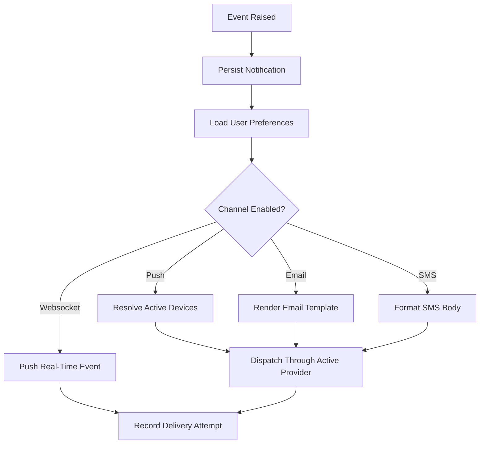


#### `docs/analysis/business-rules.md`

### Business Rules

1. Module flags determine whether routers, UI navigation, and runtime behavior are available.
2. Provider selection is environment-driven and does not require database changes.
3. Notification delivery must respect both user preferences and provider readiness.
4. A user may hold multiple active notification devices across providers and platforms.
5. Public push configuration must expose only client-safe values.
6. System discovery endpoints must remain available even when optional modules are disabled.


#### `docs/analysis/data-dictionary.md`

### Data Dictionary

| Entity | Description | Key Fields |
|---|---|---|
| User | Authenticated account holder | `id`, `email`, `username`, `is_superuser` |
| NotificationPreference | Per-user channel preferences | `websocket_enabled`, `email_enabled`, `push_enabled`, `sms_enabled` |
| NotificationDevice | Per-device push registration | `provider`, `platform`, `token`, `endpoint`, `subscription_id`, `is_active` |
| Notification | Persisted in-app alert | `title`, `body`, `type`, `is_read`, `extra_data` |
| GeneralSetting | Runtime configuration snapshot plus optional DB override | `key`, `env_value`, `db_value`, `use_db_value`, `is_runtime_editable` |
| Tenant | Multi-tenant workspace | `id`, `name`, `slug`, `owner_id` |
| Payment | Financial transaction record | `provider`, `status`, `amount`, `currency` |


#### `docs/analysis/event-catalog.md`

### Event Catalog

| Event | Producer | Consumer | Notes |
|---|---|---|---|
| `user_logged_in` | IAM | Analytics, audit trail | Updates active session state. |
| `notification_created` | Notification service | Websocket, push, email, SMS | Fan-out respects channel preferences. |
| `device_registered` | Client app | Notification registry | Stores push reachability for a device. |
| `payment_initiated` | Finance module | Provider adapter, analytics | Tracks checkout lifecycle. |
| `system_capabilities_requested` | Web or mobile client | System API | Drives capability-based UI. |


#### `docs/analysis/swimlane-diagrams.md`

### Swimlane Diagrams

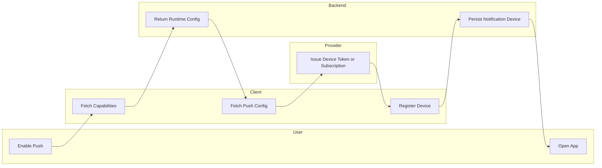


#### `docs/analysis/system-context-diagram.md`

### System Context Diagram

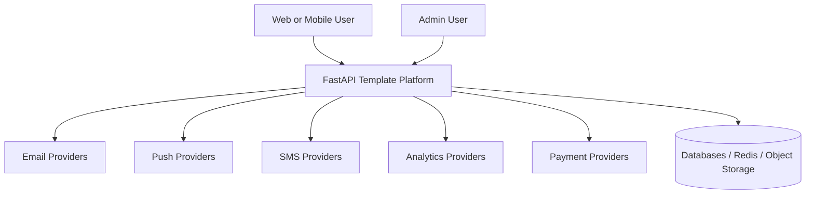


#### `docs/analysis/use-case-descriptions.md`

### Use Case Descriptions

| Use Case | Primary Actor | Trigger | Result |
|---|---|---|---|
| Authenticate | User | Login, refresh, social auth, OTP | Session is created and tracked. |
| Manage Preferences | User | Settings update | Channel preferences are persisted. |
| Receive Notifications | User | Event occurs | Websocket, push, email, or SMS delivery is attempted. |
| Switch Tenant | User | Tenant selector change | Active context changes across the app. |
| Inspect Provider Status | Operator | System API request | Runtime capability and provider readiness are returned. |
| Bootstrap New Project | Template Team | Clone template | Docs, env profiles, and modules guide setup. |


#### `docs/analysis/use-case-diagram.md`

### Use Case Diagram

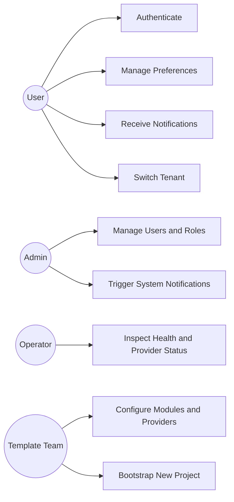


### detailed-design


#### `docs/detailed-design/api-design.md`

### API Design

#### System Endpoints

| Endpoint | Purpose |
|---|---|
| `GET /api/v1/system/capabilities/` | Enabled modules, active providers, fallbacks |
| `GET /api/v1/system/providers/` | Provider readiness by channel |
| `GET /api/v1/system/general-settings/` | Public runtime settings subset with env-vs-database source metadata |
| `GET /api/v1/system/health/` | Liveness signal |
| `GET /api/v1/system/ready/` | Readiness signal |

#### General Settings Response Shape

`GET /api/v1/system/general-settings/` returns a list of safe public settings. Each item includes:

- `key`: the config key name
- `env_value`: the current environment/bootstrap value
- `db_value`: the stored database override, if any
- `effective_value`: the value actually used at runtime
- `source`: `environment` or `database`
- `use_db_value`: whether the database override is currently active
- `is_runtime_editable`: whether the key is allowed to be overridden after boot

This endpoint is intended for runtime-aware clients such as the mobile settings screen. It must never expose secrets.

#### Notification Endpoints

| Endpoint | Purpose |
|---|---|
| `GET /api/v1/notifications/preferences/` | Fetch current user preferences |
| `PATCH /api/v1/notifications/preferences/` | Update channel flags |
| `GET /api/v1/notifications/devices/` | List registered devices |
| `POST /api/v1/notifications/devices/` | Register device token or subscription |
| `DELETE /api/v1/notifications/devices/{id}/` | Remove a registered device |
| `GET /api/v1/notifications/push/config/` | Public runtime push config |
| `PUT /api/v1/notifications/preferences/push-subscription/` | Legacy web push compatibility |
| `DELETE /api/v1/notifications/preferences/push-subscription/` | Legacy cleanup path |


#### `docs/detailed-design/c4-component-diagram.md`

### C4 Component Diagram

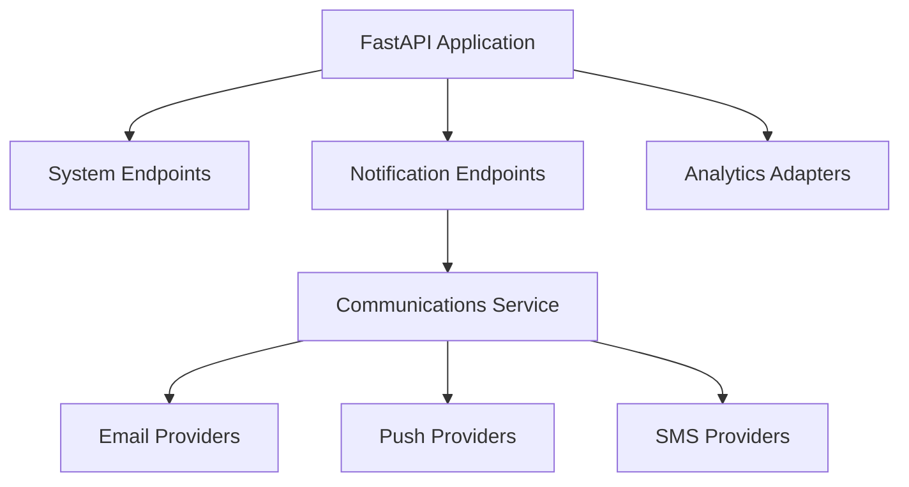


#### `docs/detailed-design/class-diagrams.md`

### Class Diagrams

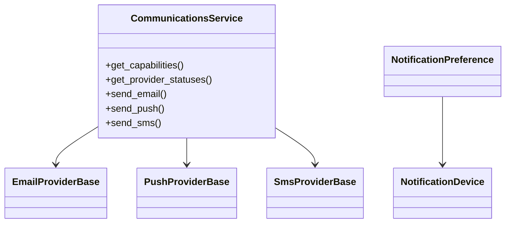


#### `docs/detailed-design/component-diagrams.md`

### Component Diagrams

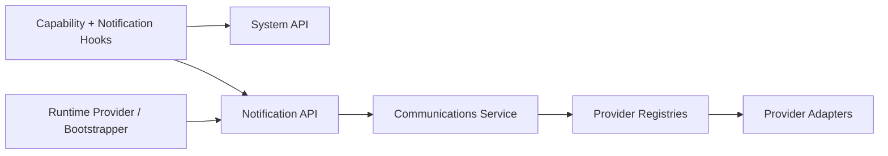


#### `docs/detailed-design/erd-database-schema.md`

### ERD Database Schema

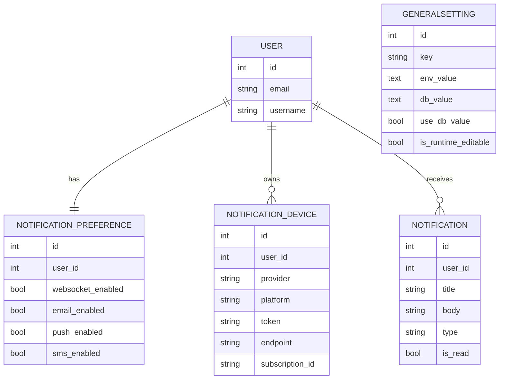

#### Notes

- `GENERALSETTING` is a standalone runtime-configuration table rather than a tenant-owned business entity.
- It is seeded during migration and refreshed on startup so operators can compare environment and database values safely.


#### `docs/detailed-design/sequence-diagrams.md`

### Sequence Diagrams

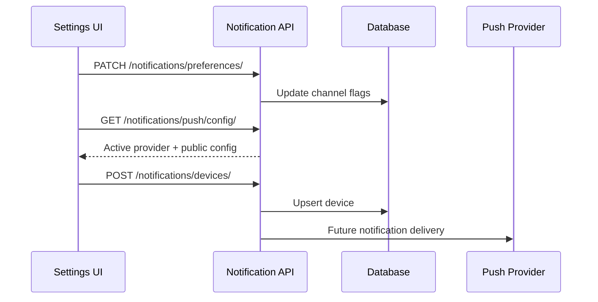


#### `docs/detailed-design/state-machine-diagrams.md`

### State Machine Diagrams

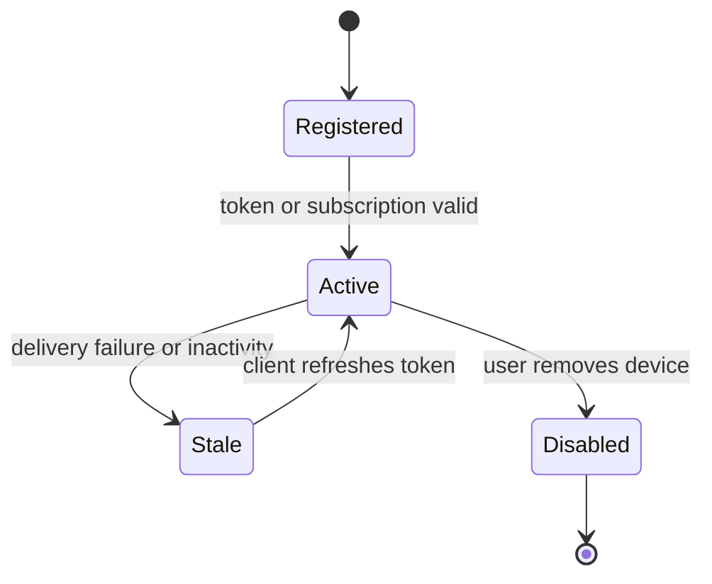


### edge-cases


#### `docs/edge-cases/api-and-ui.md`

### API and UI

- Clients must treat capability discovery as the source of truth for module visibility.
- Mobile and web should degrade gracefully when a provider is configured but not ready.
- System APIs must remain lightweight so bootstrapping does not slow first render.
- Admin-only actions should stay hidden and protected even if a route is guessed.


#### `docs/edge-cases/authentication-and-sessions.md`

### Authentication and Sessions

- Refresh token rotation must not break mobile or web reconnection flows.
- Feature-disabled auth endpoints must not be linked from the UI.
- Social auth enablement must match configured providers and redirect URLs.
- Session revocation must clear analytics identity and stored device state.


#### `docs/edge-cases/multi-tenancy.md`

### Multi-Tenancy

- Tenant-aware UI must disappear when `FEATURE_MULTITENANCY=false`.
- Cached tenant context must not leak between users.
- Analytics and notifications should include tenant metadata only when context exists.
- Invitations and membership changes must invalidate stale client state.


#### `docs/edge-cases/notifications.md`

### Notifications

- Duplicate device registrations should update the existing device instead of creating noise.
- Push preference enabled with no valid device should not break notification creation.
- `push_enabled` is now derived from active registered devices during sync operations, so removing the last active push device should disable push delivery automatically.
- `push_provider` should only resolve to a single provider when exactly one active provider is registered. When multiple active push providers exist, clients should use `push_providers` instead.
- Provider fallback should not create duplicate deliveries when the primary succeeds late.
- Legacy push-subscription endpoints must remain compatible while device registry is adopted.
- Legacy Web Push fields on the preference record are compatibility fields only. They should reflect the active Web Push device, not the entire push channel state.


#### `docs/edge-cases/operations.md`

### Operations

- Provider outages should be visible through system discovery and logs.
- Docs and CI must fail when required template documentation disappears.
- Feature-flag combinations should be smoke-tested before release.
- Migration ordering matters because this template may evolve across many downstream projects.


#### `docs/edge-cases/payments.md`

### Payments

- Payment callbacks must validate provider signatures and avoid double-processing.
- Feature-disabled finance routes should not appear in clients or docs-based bootstrap guides.
- Analytics failures must not block payment completion.
- Sandboxed provider credentials must stay separate from production credentials.


#### `docs/edge-cases/security-and-compliance.md`

### Security and Compliance

- Authorization checks must use the correct Casbin domain. A tenant-scoped request evaluated in the `global` domain can accidentally bypass intended tenant isolation.
- Public push config must never expose secrets or server-side credentials.
- Provider webhooks and callbacks require signature verification in production projects.
- Secrets must be loaded from environment or secret managers, never committed.
- Health endpoints should avoid leaking sensitive configuration details.


#### `docs/edge-cases/websockets.md`

### Websockets

- Websocket routes must be fully disabled when the feature flag is off.
- Notification fan-out should degrade to stored delivery when websocket connection is unavailable.
- Tenant changes should re-scope realtime subscriptions.
- Redis-backed pub/sub must fail safely in local development.


### high-level-design


#### `docs/high-level-design/architecture-diagram.md`

### Architecture Diagram

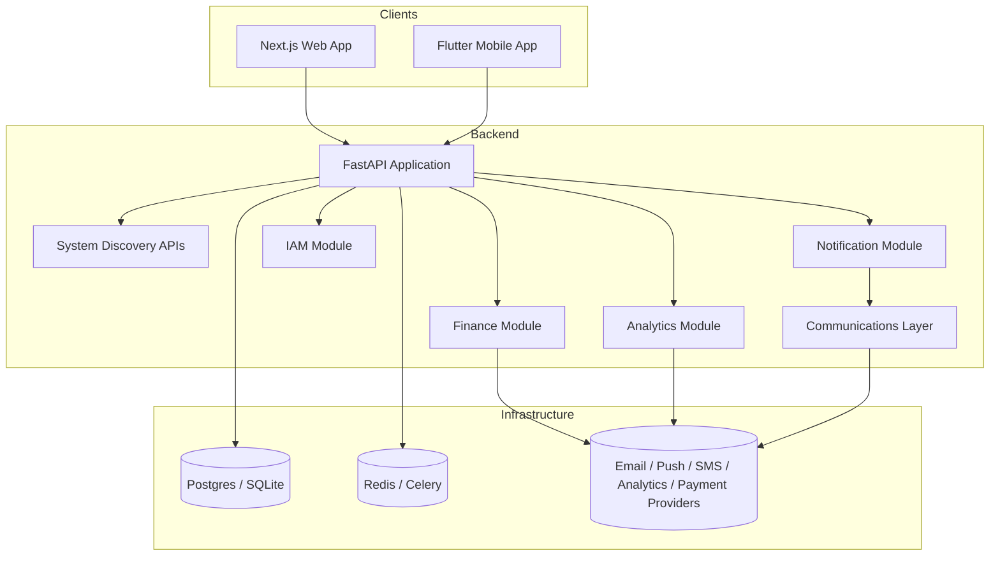


#### `docs/high-level-design/c4-diagrams.md`

### C4 Diagrams

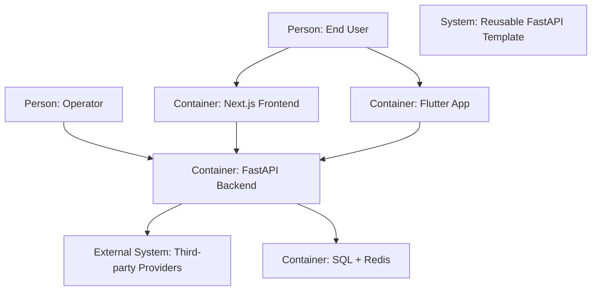


#### `docs/high-level-design/data-flow-diagrams.md`

### Data Flow Diagrams

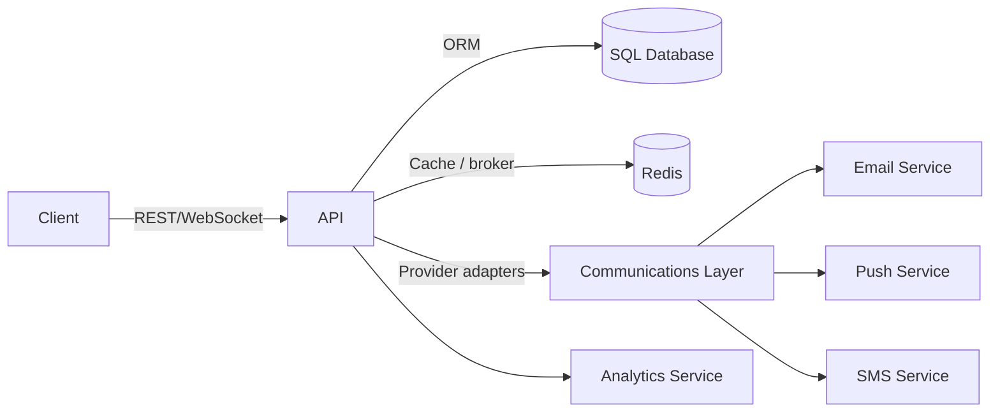


#### `docs/high-level-design/domain-model.md`

### Domain Model

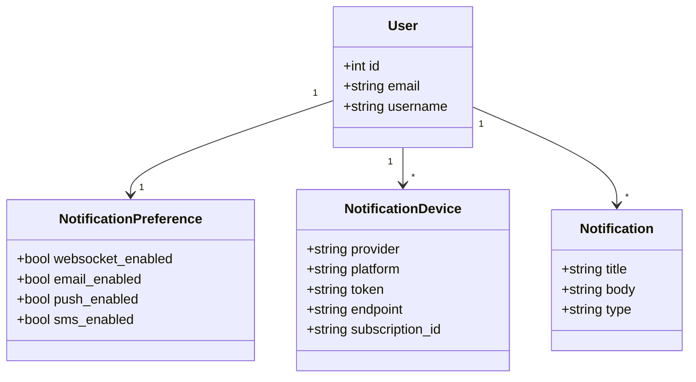


#### `docs/high-level-design/system-sequence-diagrams.md`

### System Sequence Diagrams

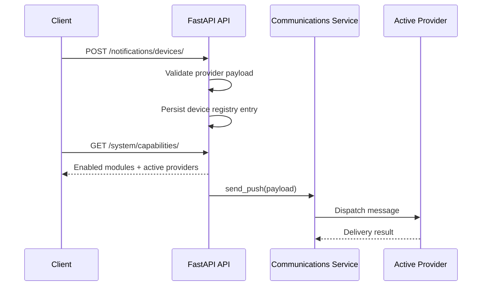


### implementation


#### `docs/implementation/c4-code-diagram.md`

### C4 Code Diagram

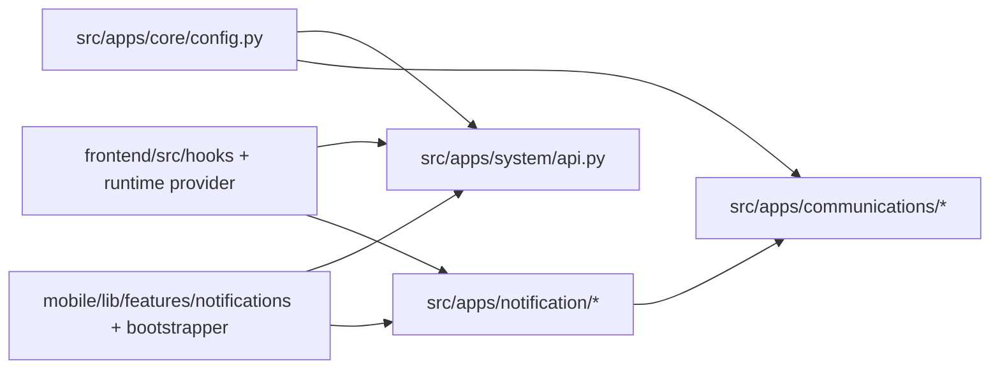


#### `docs/implementation/casbin-rbac.md`

### Casbin RBAC Guide

This project uses Casbin as the runtime authorization engine, but Casbin is only one part of the RBAC stack. The full system has two layers:

- SQL tables define the admin-managed catalog: roles, permissions, user-role assignments, and role-permission assignments.
- Casbin stores the runtime authorization tuples that are used for permission checks during requests.

If you only change one layer and forget the other, the system will look correct in the database but behave incorrectly at runtime.

#### Files That Matter

- [casbin_enforcer.py](/Users/ankit/Projects/Python/fastapi/fastapi_template/backend/src/apps/iam/casbin_enforcer.py)
- [casbin_model.conf](/Users/ankit/Projects/Python/fastapi/fastapi_template/backend/src/apps/iam/casbin_model.conf)
- [casbin_rule.py](/Users/ankit/Projects/Python/fastapi/fastapi_template/backend/src/apps/iam/models/casbin_rule.py)
- [rbac.py](/Users/ankit/Projects/Python/fastapi/fastapi_template/backend/src/apps/iam/utils/rbac.py)
- [rbac.py](/Users/ankit/Projects/Python/fastapi/fastapi_template/backend/src/apps/iam/api/v1/rbac.py)
- [main.py](/Users/ankit/Projects/Python/fastapi/fastapi_template/backend/src/main.py)

#### The Authorization Model

The active Casbin request model is domain-aware RBAC:

- Request tuple: `(subject, domain, object, action)`
- Policy tuple: `(role, domain, object, action)`
- Grouping tuple: `(user, role, domain)`

In practical terms:

- `subject` is usually the authenticated user id converted to a string.
- `domain` is either the global namespace or an organization slug from the `tenant` table.
- `object` is the permission resource such as `users`, `posts`, or `settings`.
- `action` is the permission action such as `read`, `write`, or `delete`.

The matcher in [casbin_model.conf](/Users/ankit/Projects/Python/fastapi/fastapi_template/backend/src/apps/iam/casbin_model.conf) is intentionally strict:

- The user must hold the role in the same domain.
- The requested resource must exactly match the policy resource.
- The requested action must exactly match the policy action.

There are no wildcards, regexes, path patterns, or ownership checks in the current model.

#### What Gets Stored In Casbin

Casbin persists everything to the `casbin_rule` table through the SQLAlchemy adapter.

For this project, the meaning of the columns is:

- `ptype="p"`: `v0=role`, `v1=domain`, `v2=resource`, `v3=action`
- `ptype="g"`: `v0=user_id`, `v1=role`, `v2=domain`

Examples:

```text
p, admin, global, users, read
p, admin, global, users, write
g, 42, admin, global
g, 42, owner, acme-inc
```

Those rows mean:

- The `admin` role may `read` and `write` `users` in the `global` domain.
- User `42` is an `admin` globally.
- User `42` is also an `owner` inside the `acme-inc` organization domain.

#### Request Flow

The normal permission-check path looks like this:

1. Startup loads the shared Casbin enforcer in [main.py](/Users/ankit/Projects/Python/fastapi/fastapi_template/backend/src/main.py).
2. Admin APIs create roles and permissions in SQL tables.
3. RBAC utility helpers mirror those assignments into Casbin policy rows.
4. A protected code path calls `check_permission(...)` in [rbac.py](/Users/ankit/Projects/Python/fastapi/fastapi_template/backend/src/apps/iam/utils/rbac.py).
5. `check_permission(...)` delegates to `CasbinEnforcer.enforce(...)`.
6. Casbin evaluates the request tuple against the loaded policies.

That means the SQL tables are useful for management and auditability, but the allow/deny decision is made by Casbin.

#### Global vs Tenant Domains

The constant `GLOBAL_DOMAIN = "global"` is the fallback namespace for non-organization checks.

Use the global domain when:

- The permission is application-wide.
- The resource is not tenant-scoped.

Use an organization slug when:

- Membership and access belong to one organization only.
- The same user can have different roles in different organizations.

Avoid mixing global and organization policies for the same request unless you intentionally want both behaviors to exist.

#### How To Modify It Safely

##### Add a new permission

1. Create a `Permission` row through the admin API or seed code.
2. Assign it to one or more roles through the RBAC helpers.
3. Protect the route or service with a permission check that uses the same resource and action strings.

If the strings do not match exactly, Casbin will deny the request.

##### Add a new role

1. Create the `Role` row.
2. Attach one or more permissions to the role.
3. Assign the role to users in the correct domain.

Do not insert only the SQL row and expect authorization to work. The Casbin tuple must also exist, which is why the helper functions should be preferred over manual inserts.

##### Change the matcher or policy shape

Only change [casbin_model.conf](/Users/ankit/Projects/Python/fastapi/fastapi_template/backend/src/apps/iam/casbin_model.conf) when the authorization model itself needs to change.

Examples:

- Adding wildcard resources
- Adding ownership or attribute-based checks
- Changing how domains behave

When you change the model:

1. Update this document.
2. Update [casbin_rule.py](/Users/ankit/Projects/Python/fastapi/fastapi_template/backend/src/apps/iam/models/casbin_rule.py) comments if column meaning changes.
3. Review every helper that writes policies or grouping rows.
4. Add tests for both allow and deny cases.

##### Rename a resource or action

Treat this as a data migration, not just a code rename.

You must update:

- the `Permission` rows
- any existing Casbin `p` rows
- route guards or service checks
- admin UI or API consumers that create or display permissions

##### Work with tenant roles

Organization role assignments should always include the organization slug as the domain. Reusing the global domain for organization membership will make access bleed across organizations.

#### Catalog vs Organization Membership

There are two role systems in the codebase, and they are intentionally different:

- The SQL `Role`, `Permission`, `UserRole`, and `RolePermission` tables are the global RBAC catalog.
- Organization membership lives in `TenantMember`, where `Tenant` is the organization record and `Tenant.slug` becomes the Casbin domain.

That means:

- Use the RBAC admin APIs for global roles and global permissions.
- Use the multitenancy APIs for organization membership and owner/admin/member changes.
- When a request needs an organization-scoped Casbin check, resolve the domain from the organization record instead of inventing an arbitrary string.

#### Recommended Modification Rules

- Prefer changing RBAC through the helpers in [rbac.py](/Users/ankit/Projects/Python/fastapi/fastapi_template/backend/src/apps/iam/utils/rbac.py), not through raw SQL.
- Prefer exact, stable `resource` and `action` names over human-readable phrases.
- Keep route-level authorization strings aligned with the permission catalog.
- Document any new domain conventions before multiple teams start relying on them.

#### Current Limitations

- The model only supports allow policies.
- Matching is exact, not pattern-based.
- Ownership rules are not built into the matcher.
- Superuser bypass behavior, if desired, belongs in application logic or a future model change.

If you need richer authorization than role + domain + exact permission, extend the model intentionally rather than sneaking special cases into random route handlers.


#### `docs/implementation/communications-provider-matrix.md`

### Communications Provider Matrix

| Channel | Active Providers | Notes |
|---|---|---|
| Email | SMTP, Resend, SES | Environment-driven selection with fallback list |
| Push | Web Push, FCM, OneSignal | Device registry stores provider-specific identifiers and preference responses should reflect active registered devices |
| SMS | Twilio, Vonage | Shared delivery contract through communications service |
| Analytics | PostHog, Mixpanel | Backend and clients choose provider by config |
| Payments | Khalti, eSewa, Stripe, PayPal | Existing finance registry remains available |


#### `docs/implementation/implementation-guidelines.md`

### Implementation Guidelines

- Add new providers behind interfaces and registries before wiring them into business logic.
- Prefer feature flags and capability discovery over hard-coded client assumptions.
- Keep compatibility routes until downstream projects have a migration path.
- Add tests when introducing new provider payload shapes or public runtime APIs.


#### `docs/implementation/implementation-playbook.md`

### Implementation Playbook

1. Choose feature flags for the new project.
2. Select primary and fallback providers for communications and analytics.
3. Configure environment values and secret storage.
4. Run database migrations and smoke tests.
5. Verify `/system/capabilities/`, `/system/providers/`, `/system/health/`, and `/system/ready/`.
6. Confirm web and mobile clients register notification devices correctly.
7. Run release checklist before first deployment.


#### `docs/implementation/release-checklist.md`

### Release Checklist

- Feature flags and provider settings reviewed for target environment.
- Database migrations applied successfully.
- Health and readiness endpoints verified after deploy.
- Web client typecheck, tests, and build passing.
- Mobile analyze and tests passing.
- Documentation validator clean.
- Rollback path and secrets rotation plan confirmed.


#### `docs/implementation/test-strategy.md`

### Test Strategy

- Backend: unit tests for config parsing, provider fallback, system APIs, device registration, and notification compatibility routes.
- Frontend: typecheck, Vitest unit coverage for runtime service behavior, build verification for capability-driven hooks.
- Mobile: widget smoke tests, provider bootstrap safety, and notification preference/runtime integration checks.
- Docs: manifest validation plus non-empty file checks.
- CI: gate merges on backend, frontend, mobile, and docs stages.


#### `docs/implementation/working-principles.md`

### Working Principles

#### Core Principles

1. Configuration first: features and providers are selected through settings before code branches are added.
2. Capability driven clients: web and mobile should ask the backend what is enabled instead of assuming modules exist.
3. Provider isolation: third-party integrations belong behind adapters and registries, not inside route handlers.
4. Compatibility before removal: when a public contract changes, keep a migration path until downstream projects can move.
5. Public vs private config separation: only client-safe values are exposed through discovery APIs.
6. Documentation is part of the product: every structural change must update docs and validation rules.

#### Runtime Rules

- Backend settings are the source of truth for feature flags and active providers.
- The system APIs expose enabled modules, active providers, fallbacks, and health status.
- Clients adapt navigation and registration flows based on those system APIs.
- Notification delivery respects both user preferences and provider/device readiness.
- Push preference responses should be derived from active registered devices rather than inferred from one provider-specific field.

#### Modification Rules

- Add new configuration in one place first, then expose it intentionally to the layers that need it.
- Prefer extending an interface over branching business logic around a specific vendor.
- Keep tests near the contract you changed: backend endpoints, client hooks, docs validation, or mobile providers.


### infrastructure


#### `docs/infrastructure/ci-cd.md`

### CI/CD

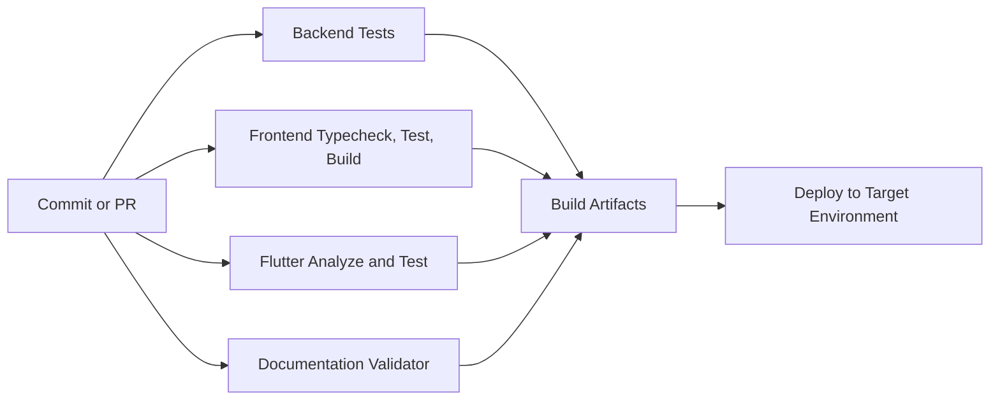


#### `docs/infrastructure/cloud-architecture.md`

### Cloud Architecture

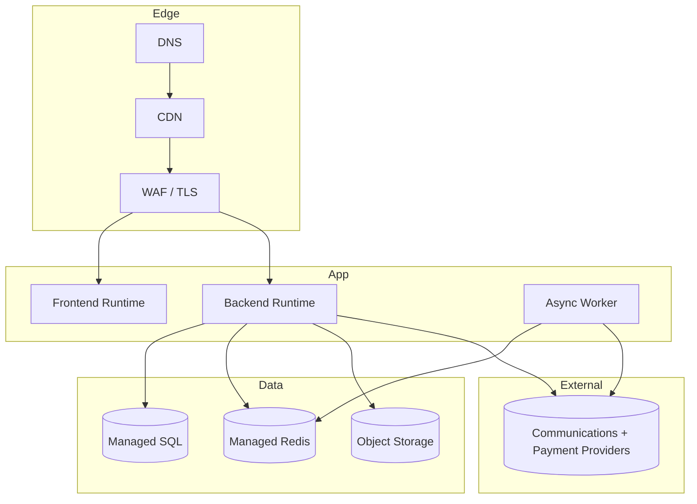


#### `docs/infrastructure/deployment-diagram.md`

### Deployment Diagram

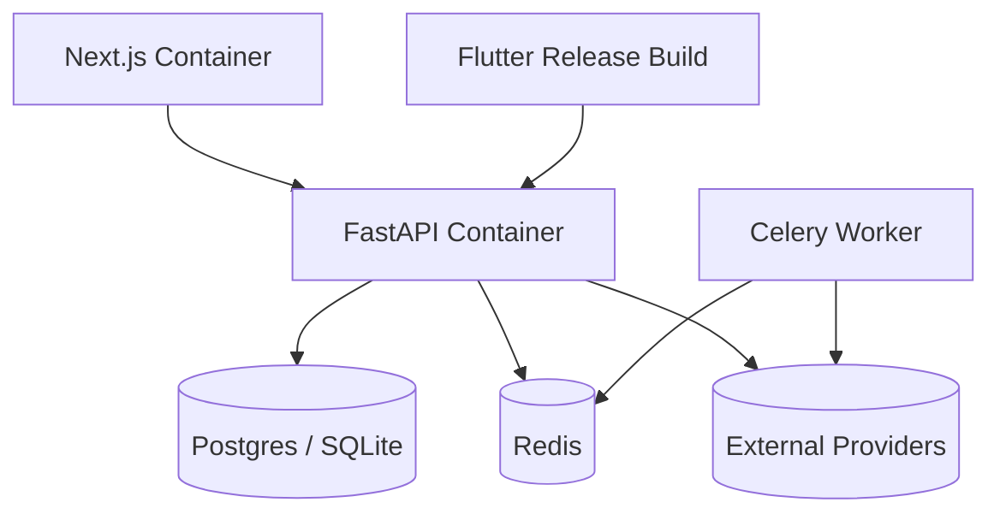


#### `docs/infrastructure/environment-configuration.md`

### Environment Configuration

| Profile | Purpose | Defaults |
|---|---|---|
| `local` | Fast feedback for developers | SQLite `app.db`, memory-backed Celery, optional providers disabled |
| `staging` | Full integration verification | Managed DB/Redis, real provider sandboxes |
| `production` | Live workloads | Hardened hosts, managed services, monitoring enabled |

#### Key Configuration Areas

- App identity: `PROJECT_NAME`, `APP_ENV`, `APP_INSTANCE_NAME`, `APP_REGION`
- Feature flags: `FEATURE_*`
- Communications: `EMAIL_PROVIDER`, `PUSH_PROVIDER`, `SMS_PROVIDER`, fallbacks
- Analytics: `ANALYTICS_PROVIDER`, provider credentials
- Payments: provider-specific enablement and secrets
- Runtime: database, Redis, Celery, CORS, trusted hosts, cookies, media, frontend URLs
- Operations: logging, suspicious-activity thresholds, rate limits, timeout/retry policy, websocket heartbeat/origin settings

#### Database Naming Convention

- The default logical database name is `app`.
- In local SQLite mode, this resolves to:
  - `DATABASE_URL=sqlite+aiosqlite:///./app.db`
  - `SYNC_DATABASE_URL=sqlite:///./app.db`
- In non-debug relational deployments, `POSTGRES_DB=app` is the default unless an environment overrides it explicitly.

#### Runtime Override Rules

- The backend starts from environment values first.
- After the database connection is available, the `generalsetting` table can override runtime-safe keys.
- Bootstrap-only keys such as `DATABASE_URL` and `SYNC_DATABASE_URL` are intentionally excluded from runtime DB override.
- Startup-sensitive values may still require an application restart even when a database override exists.

#### Startup-Sensitive Groups

These values are the most likely to require process restart even if they are runtime-editable:

- middleware and ingress behavior: trusted hosts, proxy trust, CORS, cookies
- worker bootstrap: Celery eager mode, broker wiring, default queue
- database engine behavior: pool size, overflow, timeout, recycle
- storage and filesystem mounting behavior
- websocket process-level heartbeat and idle handling

#### Recommended Mental Model

- Environment/profile selection decides the baseline shape of a deployment.
- Runtime-safe DB overrides fine-tune behavior after the app is running.
- Public system APIs are for client-safe discovery only, not for leaking private operational state.


#### `docs/infrastructure/network-infrastructure.md`

### Network Infrastructure

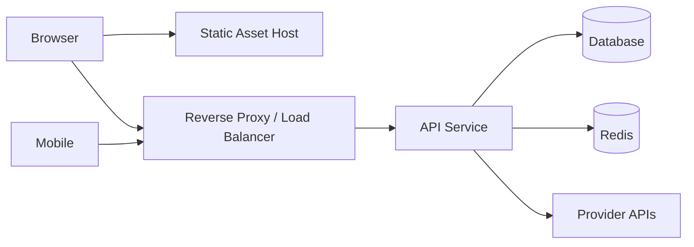


#### `docs/infrastructure/production-hardening-checklist.md`

### Production Hardening Checklist

Use this document before promoting a downstream project beyond local development. The template is production-capable, but these reviews still belong to the project team.

#### Secrets

- Move `SECRET_KEY`, database credentials, provider credentials, webhook secrets, and service-account material into a proper secret manager or deployment secret store.
- Keep secret-only values env-managed; do not expose them through `generalsetting` or client discovery APIs.
- Rotate default placeholder values before the first shared environment.

#### Network and Proxy Trust

- Replace permissive local defaults for `TRUSTED_HOSTS`, `PROXY_TRUSTED_HOSTS`, and `FORWARDED_ALLOW_IPS` with the exact values used by your ingress and proxy chain.
- Review `BACKEND_CORS_ORIGINS`, `FRONTEND_URL`, and `SERVER_HOST` for each environment.
- Confirm `SECURE_COOKIES=True`, `COOKIE_DOMAIN`, and `COOKIE_SAMESITE` for any non-local deployment.

#### Storage and Data Retention

- Choose the storage backend intentionally and verify bucket policies, object ACL strategy, and media base URLs if you use S3-compatible storage.
- Review log retention, audit data retention, and backup expectations before production rollout.
- Confirm DB pool settings match the deployed database size and connection limits.

#### Providers and Callbacks

- Verify each enabled provider with environment-appropriate credentials.
- Validate webhook signatures and callback URLs for payment, auth, and notification providers.
- Keep sandbox and production credentials separate and documented in your deployment system.

#### Worker and Background Processing

- Run Celery with explicit broker/result backend settings and confirm queue names, time limits, and retries suit your workload.
- Make sure worker startup uses the same env source-of-truth as the API process.
- Add platform-level monitoring for failed tasks, queue backlog, and retry storms.

#### Observability and Response

- Tune log outputs, suspicious-activity thresholds, and incident review ownership for your team.
- Verify health and readiness endpoints through your deployment platform.
- Decide who owns admin review of security incidents before going live.


### onboarding


#### `docs/onboarding/configuration-management.md`

### Configuration Management

This document explains where configuration lives, how the project chooses the effective value at runtime, and how to decide whether a new setting should stay private, become runtime-editable, or be exposed to clients.

#### How Configuration Works

##### Backend

- Backend runtime settings are defined in [backend/src/apps/core/config.py](/Users/ankit/Projects/Python/fastapi/fastapi_template/backend/src/apps/core/config.py).
- Values bootstrap from process environment and `backend/.env` through `pydantic-settings`.
- `backend/.env.example` is the committed template reference, while `backend/.env` is the primary local working file.
- After the database is available, runtime setting reads can be overridden from the `generalsetting` table.
- On startup, the backend syncs the current environment snapshot into `generalsetting.env_value`.
- Feature flags such as `FEATURE_NOTIFICATIONS` control router registration and runtime behavior.
- Provider settings such as `EMAIL_PROVIDER`, `PUSH_PROVIDER`, `SMS_PROVIDER`, and `ANALYTICS_PROVIDER` select the active implementation.
- Bootstrap-only settings remain environment-driven so the app can connect to infrastructure before runtime overrides are loaded.
- Runtime-overridable operational groups now include:
  - environment identity (`APP_ENV`, `APP_INSTANCE_NAME`, `APP_REGION`)
  - host/proxy and cookie controls
  - rate limits and suspicious-activity thresholds
  - Celery task behavior
  - DB pool tuning
  - media/storage routing
  - shared HTTP timeout/retry policy
  - websocket origin/heartbeat controls

##### Runtime Resolution Order

When the backend needs a setting, it resolves it in this order:

1. Default value in the `Settings` model.
2. Value from process environment or the configured `.env` file.
3. Database override from `generalsetting` if:
   - the key is runtime-editable
   - `use_db_value=true`
   - `db_value` is present

That means the environment still defines the baseline, while the database can adjust selected runtime-safe values later.

#### Config Classification

| Class | Stored in | Typical examples | Restart needed? |
|---|---|---|---|
| Bootstrap-only | `backend/.env`, deployment env, secret manager | database URLs, broker URLs, secret keys | yes |
| Runtime-editable | env baseline plus `generalsetting` override | rate limits, observability thresholds, retry policy | sometimes |
| Public runtime | backend allowlist and discovery APIs | `PROJECT_NAME`, `APP_ENV`, enabled features, active providers | client fetch, no rebuild when runtime-driven |
| Secret-only | env / secret manager only | vendor credentials, signing keys, webhook secrets | yes |

Runtime-editable does not always mean hot-reloadable. Anything consumed during process startup, middleware registration, worker bootstrap, or DB engine creation still requires a restart to fully apply.

##### General Settings Table

- Table name: `generalsetting`
- Purpose: persist the known configuration keys, the current environment value, and an optional database override.
- Core columns:
  - `key`: unique config key name
  - `env_value`: latest value discovered from environment/bootstrap config
  - `db_value`: optional value to apply at runtime
  - `use_db_value`: when `true`, runtime reads prefer `db_value`
  - `is_runtime_editable`: marks keys that are safe to override after boot
- Seed behavior:
  - The Alembic migration creates and seeds the table with all known settings.
  - Startup sync keeps `env_value` current for future comparisons.
  - Non-secret operational settings can opt into `db_value`.
  - Secrets and bootstrap-only infrastructure settings remain `is_runtime_editable = false`.
  - Some settings are still consumed during process startup (for example middleware, Celery bootstrap, and DB engine setup), so changing them may still require an application restart to fully apply.

##### Frontend

- Web configuration uses `NEXT_PUBLIC_*` variables for browser-safe startup values and `frontend/.env.local` is the primary local file.
- The frontend also fetches runtime config from `/api/v1/system/capabilities/` and `/api/v1/notifications/push/config/`.
- The frontend should treat backend discovery APIs as the runtime source of truth for what is enabled.
- If a value is secret or vendor-sensitive, it must stay on the backend and never be moved into `NEXT_PUBLIC_*`.

##### Mobile

- Flutter reads `mobile/.env` through `flutter_dotenv` for app startup values.
- Mobile capability and push settings are also fetched from backend system APIs so the app can react to deployment-specific configuration.
- Mobile now also reads `/api/v1/system/general-settings/` for a safe public subset of runtime configuration, including whether a value is currently coming from environment or database.

#### How Config Affects Behavior

##### Feature flags

- Feature flags primarily change router registration in [main.py](/Users/ankit/Projects/Python/fastapi/fastapi_template/backend/src/main.py).
- Clients should read capability discovery APIs and adapt their navigation or flows accordingly.

##### Providers

- Provider selection mainly affects the communications layer, analytics adapters, maps, and payments.
- The provider name is config-driven.
- The implementation switch should happen inside registries and adapters, not in route handlers.

##### Operational settings

- Cookie, proxy, trusted-host, DB pool, rate-limit, storage, Celery, and websocket settings directly change backend runtime behavior.
- Many of these settings are read during startup, so changing them in the database may still require restarting backend or worker processes.

##### Public settings

- Public settings affect frontend or mobile only if the key is intentionally allowlisted.
- Public settings should be treated as stable client contracts.

#### How To Manage Configuration

1. Add or change the backend setting in `config.py`.
2. Add the new variable to the env template used by the repo.
   Use `backend/.env.example`, `frontend/.env.local.example`, or `mobile/.env.example` depending on the owning surface.
3. Decide whether the key is:
   - bootstrap-only
   - runtime-editable
   - secret
   - public
4. Wire the setting into the code path where behavior actually changes.
5. If it is browser-safe and genuinely useful at runtime, add it to the public allowlist for `/api/v1/system/general-settings/`.
6. Document it in onboarding and infrastructure docs.
7. Add tests for parsing, defaults, sync behavior, and any public API shape change.

#### How To Decide Where A Setting Belongs

##### Keep it env-only

Use env-only when the value is needed before the database is available or when it would be risky to change at runtime.

Examples:

- database URLs
- broker URLs
- signing secrets
- vendor credentials
- service-account files

##### Make it runtime-editable

Use runtime-editable when the value is operational, non-secret, and useful to adjust without a deploy.

Examples:

- rate limits
- log outputs or thresholds
- observability thresholds
- timeout and retry policies
- feature flags for controlled environments

##### Make it public

Only make a setting public when the client really needs it and the value is safe for the browser or mobile app.

Examples:

- project or environment identity
- enabled feature flags
- active provider names
- public push or maps config

#### Public vs Private Configuration

- Private: secrets, API keys, signing keys, database credentials, broker URLs, service-account JSON, and file-path credentials.
- Runtime private: non-secret backend-only operational knobs such as pool sizes, proxy trust, rate limits, storage backend selection, and observability thresholds.
- Public: feature flags, active provider names, payment-provider enablement, project name, and any explicitly allowlisted runtime-safe client settings.

#### Common Mistakes To Avoid

- Adding a setting to `config.py` but never wiring it into runtime behavior.
- Keeping docs pointed at a different env file than the one the code actually loads.
- Making a secret runtime-editable through `generalsetting`.
- Exposing an operational backend-only setting to public system APIs.
- Changing a feature flag without updating client visibility rules.
- Treating a startup-sensitive setting as if it will hot-reload safely.

#### Safe Change Checklist

- Is the config secret or public?
- Is the config bootstrap-only or safe for runtime override?
- Does the web app need it at build time or can it fetch it at runtime?
- Does the mobile app need an env fallback?
- Does the new key need a `generalsetting` row exposed or kept private?
- Did the docs and validator get updated?


#### `docs/onboarding/deployment.md`

### Deployment

1. Build backend and frontend artifacts.
2. Apply migrations before shifting traffic.
3. Confirm health and readiness endpoints.
4. Verify client capability discovery matches target feature flags.
5. Smoke test auth, notifications, provider discovery, and payments if enabled.


#### `docs/onboarding/environment-profiles.md`

### Environment Profiles

| Profile | Use |
|---|---|
| `local` | Local cloning, feature experimentation, and UI development |
| `staging` | Integrated provider and deployment rehearsal |
| `production` | Live traffic with hardened hosts, secrets, and monitoring |

Each profile should define feature flags, primary providers, fallback order, database targets, Redis settings, and public client config.

For local development, the default SQLite target is `app.db`. If a team changes the logical database name, they should update `POSTGRES_DB`, `DATABASE_URL`, and `SYNC_DATABASE_URL` together to avoid drift.


#### `docs/onboarding/local-setup.md`

### Local Setup

The template now has one documented bootstrap path from the repository root. Use it first before you start customizing anything.

#### Bootstrap Workflow

1. Run `make setup`.
   This copies env templates if needed, installs backend dependencies with `uv`, installs frontend dependencies with `npm`, and installs Flutter dependencies when Flutter is available.
2. Review the generated env files:
   - `backend/.env`
   - `frontend/.env.local`
   - `mobile/.env`
3. Start infrastructure with `make infra-up`.
4. Run database migrations with `make backend-migrate`.
   This creates the schema and seeds the `generalsetting` table from the current environment baseline.

#### Run The Applications

- API: `make backend-dev`
- Web: `make frontend-dev`
- Mobile: `make mobile-dev`

If you prefer containers for everything, `make dev-up` still works, but the root bootstrap path above is the recommended template workflow.

#### Validate The Starter

1. Run `make health-check` after the backend is up.
2. Confirm these discovery endpoints respond:
   - `/api/v1/system/health/`
   - `/api/v1/system/ready/`
   - `/api/v1/system/capabilities/`
   - `/api/v1/system/providers/`
   - `/api/v1/system/general-settings/`
3. Run `make ci` before treating the starter as your project baseline.

#### Notes About Configuration

- The backend settings model reads process environment and `backend/.env` by default.
- External process env injection is still allowed and overrides file values, but the template’s primary editable file is `backend/.env`.
- For local SQLite development, confirm that the backend is using `app.db` unless you intentionally override the database name.
- Some runtime-editable settings are still startup-sensitive. Middleware, Celery bootstrap, DB engine options, and similar process wiring may require a restart after a DB override.


#### `docs/onboarding/modifying-the-template.md`

### Modifying the Template

Use this document when you already understand the project structure and want a safe pattern for changing it. If you are new to the repo, read [project-orientation.md](/Users/ankit/Projects/Python/fastapi/fastapi_template/docs/onboarding/project-orientation.md) first.

#### Safe Modification Workflow

1. Identify the layer you are changing: backend, frontend, mobile, docs, or infrastructure.
2. Confirm the source of truth for that behavior.
   Usually this is backend config, provider registries, system discovery APIs, or data models.
3. Update the source-of-truth config first.
4. Extend interfaces and registries before editing route or UI logic.
5. Update clients to consume capability discovery instead of hard-coded assumptions.
6. Add or adjust tests.
7. Update docs and run the validator.

#### Common Modification Patterns

##### Add a New Provider

- Add settings in `config.py`.
- Create an adapter in the backend provider layer.
- Register it in the communications or analytics factory.
- Expose any client-safe values through discovery APIs.
- Add web/mobile registration or SDK wiring if the provider is client-facing.
- Update env templates and provider docs.

##### Add a New Feature Flagged Module

- Add a `FEATURE_*` setting.
- Gate router registration in `main.py`.
- Hide or show related UI through capability discovery.
- Document what happens when the module is disabled.
- Add tests for both enabled and disabled states when practical.

##### Add or Change Operational Behavior

- Start by checking whether the project already has a config group for that concern.
- If the behavior should be configurable, add or reuse a setting instead of hard-coding a new constant.
- Wire the setting into the actual runtime entrypoint:
  - `main.py` for app startup or middleware
  - service layers for business logic
  - provider adapters for external integrations
  - client runtime hooks for browser or mobile-visible behavior
- Decide whether the setting is env-only, runtime-editable, or public.

##### Switch From Local Storage To Object Storage

- Set `STORAGE_BACKEND=s3`.
- Fill in the bucket, region, endpoint, and path-style settings in `backend/.env`.
- Verify the storage helper layer produces the URLs you expect before changing any client assumptions.
- Keep `MEDIA_BASE_URL` explicit if your public asset domain differs from the API host.

##### Move From Local To Staging Or Production

- Start with the profile guidance in [environment-configuration.md](/Users/ankit/Projects/Python/fastapi/fastapi_template/docs/infrastructure/environment-configuration.md).
- Review the hardening steps in [production-hardening-checklist.md](/Users/ankit/Projects/Python/fastapi/fastapi_template/docs/infrastructure/production-hardening-checklist.md).
- Replace local-friendly proxy, cookie, and provider defaults with environment-specific values.
- Re-run `make ci` and `make health-check` after the environment is deployed.

##### Change an Existing Public API

- Preserve compatibility when possible.
- Update web and mobile consumers in the same change.
- Add migration notes to the docs if downstream projects might already depend on the old contract.

#### Files You Usually Touch

- Backend settings: [config.py](/Users/ankit/Projects/Python/fastapi/fastapi_template/backend/src/apps/core/config.py)
- Backend app wiring: [main.py](/Users/ankit/Projects/Python/fastapi/fastapi_template/backend/src/main.py)
- Runtime override flow: [settings_store.py](/Users/ankit/Projects/Python/fastapi/fastapi_template/backend/src/apps/core/settings_store.py)
- System discovery APIs: [api.py](/Users/ankit/Projects/Python/fastapi/fastapi_template/backend/src/apps/system/api.py)
- Web runtime hooks: [use-system.ts](/Users/ankit/Projects/Python/fastapi/fastapi_template/frontend/src/hooks/use-system.ts)
- Mobile runtime bootstrap: [notification_bootstrapper.dart](/Users/ankit/Projects/Python/fastapi/fastapi_template/mobile/lib/features/notifications/presentation/widgets/notification_bootstrapper.dart)

#### Do Not Skip

- Update `backend/.env.example`
- Update `frontend/.env.local.example` or `mobile/.env.example` if the change affects those surfaces
- Update any env handling notes if the loading path changes
- Update `docs/`
- Run `make ci`


#### `docs/onboarding/project-orientation.md`

### Project Orientation

This document is the fastest way to understand how the template is put together, where the important decisions live, and how to safely adapt it for a real project.

#### What This Template Is

This repository is a reusable full-stack starter made of three main application layers:

- Backend: FastAPI API, auth/session handling, admin APIs, runtime configuration, observability, providers, background jobs, and database access.
- Frontend: Next.js web app that discovers what the backend has enabled and adapts its UI from runtime APIs instead of assuming every feature exists.
- Mobile: Flutter client with the same capability-driven approach for runtime features and public configuration.

The template is built to be configuration-first. Most project customization should start by changing settings, feature flags, and provider choices before writing new branching logic.

#### How The System Fits Together

##### Backend

The backend is the runtime source of truth.

- [config.py](/Users/ankit/Projects/Python/fastapi/fastapi_template/backend/src/apps/core/config.py) defines the settings model, default values, parsing rules, and which values are public or runtime-editable.
- [main.py](/Users/ankit/Projects/Python/fastapi/fastapi_template/backend/src/main.py) wires those settings into the running app by registering middleware, feature-gated routers, CORS, trusted hosts, rate limiting, and media serving.
- [settings_store.py](/Users/ankit/Projects/Python/fastapi/fastapi_template/backend/src/apps/core/settings_store.py) syncs environment settings into the `generalsetting` table and applies database overrides for keys that are allowed to change at runtime.
- [system/api.py](/Users/ankit/Projects/Python/fastapi/fastapi_template/backend/src/apps/system/api.py) exposes safe runtime discovery to clients.
- [implementation/casbin-rbac.md](/Users/ankit/Projects/Python/fastapi/fastapi_template/docs/implementation/casbin-rbac.md) explains how SQL roles and permissions are mirrored into Casbin for runtime authorization.

##### Frontend and Mobile

The frontend and mobile apps do not decide on their own which modules exist.

- They ask the backend which modules and providers are enabled.
- They use public config APIs for client-safe runtime values.
- They should hide, show, or adapt screens based on capability discovery instead of hard-coded assumptions.

That design lets one template power different projects without each client needing a separate code fork for every feature combination.

#### The Configuration Flow

This is the most important mental model in the project:

1. A setting is defined in [config.py](/Users/ankit/Projects/Python/fastapi/fastapi_template/backend/src/apps/core/config.py).
2. The backend loads bootstrap values from process environment and `backend/.env`.
3. During startup, the backend syncs the environment snapshot into the `generalsetting` table.
4. For runtime-safe keys, the database can override the environment value when `use_db_value=true`.
5. The effective settings are then used by the app, middleware, workers, services, and discovery APIs.
6. Only explicitly allowlisted keys are exposed publicly to frontend or mobile clients.

#### What Each Config Group Controls

##### Core identity and environment

- `PROJECT_NAME`, `APP_ENV`, `APP_INSTANCE_NAME`, `APP_REGION`
- These help identify the deployment and are useful for docs, operators, and clients.

##### Feature flags

- `FEATURE_AUTH`, `FEATURE_FINANCE`, `FEATURE_ANALYTICS`, `FEATURE_WEBSOCKETS`, and similar flags
- These decide whether routers and runtime behavior are registered at all.
- In practice, feature flags are the first place to start when slimming the template down for a new project.

##### Security, sessions, and cookies

- Auth token lifetime, cookie names, `SECURE_COOKIES`, `COOKIE_DOMAIN`, `COOKIE_SAMESITE`
- Trusted host and proxy behavior also live in config and affect deployment hardening.

##### Providers

- Email, push, SMS, analytics, maps, and payments are selected through provider settings.
- Credentials stay private on the backend.
- Public provider state is exposed through system discovery APIs only when safe.

##### Operations

- Logging outputs and retention
- Rate limits
- Suspicious activity thresholds
- Celery runtime behavior
- Database pool tuning
- Shared outbound HTTP timeout and retry policy
- Websocket origin and heartbeat controls

##### Storage

- Media can use local filesystem or S3-style object storage through `STORAGE_BACKEND`.
- URL generation is normalized through the storage helper layer.

#### What Happens When You Change Something

Different settings affect different parts of the system:

- Feature flags usually change router registration in [main.py](/Users/ankit/Projects/Python/fastapi/fastapi_template/backend/src/main.py) and should also change frontend/mobile visibility.
- Provider settings usually affect service adapters and system discovery responses.
- Cookie, host, DB pool, middleware, and Celery settings are startup-sensitive and may require a process restart even if they are runtime-editable in the database.
- Public config changes may require frontend or mobile UI updates if the client should react to them.

#### How To Modify The Template Safely

##### If you want to remove a feature

1. Turn off the relevant `FEATURE_*` flag.
2. Verify the backend no longer registers the router.
3. Remove or hide the matching frontend/mobile navigation.
4. Update docs so the next team knows the feature was intentionally excluded.

##### If you want to add a new provider

1. Add provider settings in [config.py](/Users/ankit/Projects/Python/fastapi/fastapi_template/backend/src/apps/core/config.py).
2. Add the provider adapter in the backend service layer.
3. Register it in the appropriate provider registry.
4. Expose only safe public values through discovery APIs if clients need them.
5. Update provider docs and tests.

##### If you want to add a new operational setting

1. Add it to [config.py](/Users/ankit/Projects/Python/fastapi/fastapi_template/backend/src/apps/core/config.py).
2. Decide whether it is bootstrap-only, runtime-editable, secret, or public.
3. Wire it into the code path where behavior actually changes.
4. Add it to `backend/.env.example` and docs.
5. Add tests for parsing and behavior, not just for the setting existing.

##### If you want to expose a setting to clients

Only do that if the value is genuinely safe and useful in the browser or mobile app.

1. Keep the source of truth on the backend.
2. Add the key to the public allowlist only if it is safe.
3. Fetch it through system APIs instead of duplicating it into multiple clients unless build-time behavior really requires it.

#### Files That Usually Matter Most

- Backend settings: [config.py](/Users/ankit/Projects/Python/fastapi/fastapi_template/backend/src/apps/core/config.py)
- Backend runtime wiring: [main.py](/Users/ankit/Projects/Python/fastapi/fastapi_template/backend/src/main.py)
- Runtime settings store: [settings_store.py](/Users/ankit/Projects/Python/fastapi/fastapi_template/backend/src/apps/core/settings_store.py)
- System discovery endpoints: [api.py](/Users/ankit/Projects/Python/fastapi/fastapi_template/backend/src/apps/system/api.py)
- Communications service: [service.py](/Users/ankit/Projects/Python/fastapi/fastapi_template/backend/src/apps/communications/service.py)
- Authorization model guide: [casbin-rbac.md](/Users/ankit/Projects/Python/fastapi/fastapi_template/docs/implementation/casbin-rbac.md)
- Observability service: [service.py](/Users/ankit/Projects/Python/fastapi/fastapi_template/backend/src/apps/observability/service.py)
- Frontend runtime hooks: [use-system.ts](/Users/ankit/Projects/Python/fastapi/fastapi_template/frontend/src/hooks/use-system.ts)

#### Recommended Reading Order

1. [docs/README.md](/Users/ankit/Projects/Python/fastapi/fastapi_template/docs/README.md)
2. [project-orientation.md](/Users/ankit/Projects/Python/fastapi/fastapi_template/docs/onboarding/project-orientation.md)
3. [configuration-management.md](/Users/ankit/Projects/Python/fastapi/fastapi_template/docs/onboarding/configuration-management.md)
4. [modifying-the-template.md](/Users/ankit/Projects/Python/fastapi/fastapi_template/docs/onboarding/modifying-the-template.md)
5. [template-finalization-checklist.md](/Users/ankit/Projects/Python/fastapi/fastapi_template/docs/onboarding/template-finalization-checklist.md)
6. [provider-configuration.md](/Users/ankit/Projects/Python/fastapi/fastapi_template/docs/onboarding/provider-configuration.md)

If you follow those in order, you should understand both how the template works today and how to change it without fighting the architecture.


#### `docs/onboarding/provider-configuration.md`

### Provider Configuration

Provider selection is backend-driven. Clients should discover active providers from backend system APIs instead of hard-coding a provider choice.

- Email: choose `EMAIL_PROVIDER` and optional `EMAIL_FALLBACK_PROVIDERS`.
- Push: choose `PUSH_PROVIDER` and configure Web Push, FCM, or OneSignal credentials.
- SMS: choose `SMS_PROVIDER` with Twilio or Vonage credentials.
- Analytics: choose `ANALYTICS_PROVIDER` with PostHog or Mixpanel credentials.
- Payments: enable the gateways needed for the downstream project.
- Public provider state can be inspected from `/api/v1/system/providers/` and `/api/v1/system/general-settings/`.

#### How To Change Providers Safely

1. Set the provider name and credentials in backend config.
2. Confirm the adapter is registered in the backend service layer.
3. Verify `/api/v1/system/providers/` reflects the expected readiness state.
4. If the provider needs client SDK setup, expose only the minimum safe public values.
5. Test both the happy path and the fallback path if fallbacks are configured.
6. Keep sandbox and production credentials separate, and validate callback or webhook verification before go-live.


#### `docs/onboarding/start-a-new-project.md`

### Start a New Project

1. Clone the template and run `make setup`.
2. Read [project-orientation.md](/Users/ankit/Projects/Python/fastapi/fastapi_template/docs/onboarding/project-orientation.md) and [template-finalization-checklist.md](/Users/ankit/Projects/Python/fastapi/fastapi_template/docs/onboarding/template-finalization-checklist.md).
3. Rename project identifiers and set `PROJECT_NAME`, `APP_INSTANCE_NAME`, and environment identity values.
4. Decide which modules stay enabled.
5. Choose primary and fallback providers per channel.
6. Remove any unused client routes, pages, and docs references.
7. Keep the docs tree and validator updated as the new project diverges.


#### `docs/onboarding/template-finalization-checklist.md`

### Template Finalization Checklist

Use this checklist when you are turning the starter into a real downstream project. It helps you separate "rename the template" work from "shape the product" work.

#### Before You Rename Anything

1. Read [project-orientation.md](/Users/ankit/Projects/Python/fastapi/fastapi_template/docs/onboarding/project-orientation.md), [configuration-management.md](/Users/ankit/Projects/Python/fastapi/fastapi_template/docs/onboarding/configuration-management.md), and [modifying-the-template.md](/Users/ankit/Projects/Python/fastapi/fastapi_template/docs/onboarding/modifying-the-template.md).
2. Run `make setup` so every app surface has a local env file.
3. Run `make infra-up` and `make backend-migrate` once to confirm the baseline template boots cleanly before you customize it.
4. Capture the initial health of the starter with `make health-check` and `make ci`.

#### Rename The Template Identity

- Change `PROJECT_NAME`, `APP_INSTANCE_NAME`, and any product-facing names in backend, frontend, mobile, and docs.
- Review package/app identifiers in `frontend/package.json`, Flutter metadata, and deployment manifests.
- Update branded copy in the top-level [README.md](/Users/ankit/Projects/Python/fastapi/fastapi_template/README.md) and docs index.

#### Module Review

- Decide which `FEATURE_*` modules stay enabled.
- Remove navigation, routes, and docs references for modules your project will not ship.
- Keep capability discovery in place for the modules that remain so web and mobile continue to adapt safely.

#### Provider Review

- Choose primary providers for email, push, SMS, analytics, maps, and payments.
- Remove provider credentials you will never use from deployment secrets management.
- Test sandbox credentials first, then document the production cutover separately.

#### Configuration Review

Use this quick classification rule:

| Setting type | Where it lives | What it controls |
|---|---|---|
| Bootstrap-only | env / deployment secrets | infra connection, secrets, startup wiring |
| Runtime-editable | `generalsetting` plus env baseline | safe operational tuning after boot |
| Public runtime | backend allowlist and discovery APIs | browser/mobile-safe values |
| Secret-only | env / secret manager only | credentials, signing keys, webhook secrets |

- Review [backend/.env.example](/Users/ankit/Projects/Python/fastapi/fastapi_template/backend/.env.example) group by group.
- Confirm which settings are startup-sensitive and require restart even if they are runtime-editable.
- Trim any public general settings your project does not actually need clients to consume.

#### Storage And Data Review

- Choose `STORAGE_BACKEND=local` or `s3` intentionally.
- Review database naming, media URLs, and retention policies before the first shared environment.
- Confirm local bootstrap still works if you keep SQLite for development.

#### Production Readiness Review

- Review [production-hardening-checklist.md](/Users/ankit/Projects/Python/fastapi/fastapi_template/docs/infrastructure/production-hardening-checklist.md).
- Revisit rate limits, suspicious-activity thresholds, and cookie settings for your real traffic profile.
- Verify host/proxy trust, webhook validation, and provider callback URLs in staging before production.


### requirements


#### `docs/requirements/requirements.md`

### Requirements

#### Goal

Deliver a reusable full-stack template that can be cloned into multiple projects without re-architecting authentication, communications, analytics, finance, or deployment concerns.

#### Functional Requirements

- Support module toggles for auth, multi-tenancy, notifications, websockets, finance, analytics, and social auth.
- Expose pluggable providers for email, push, SMS, analytics, and payments.
- Provide backend endpoints for capability discovery, provider readiness, health, and readiness.
- Support notification delivery to multiple devices per user.
- Ship web and mobile clients that adapt to enabled modules and active providers.

#### Non-Functional Requirements

- Configuration-first switching between providers.
- Safe defaults for local development.
- Production-ready observability and deployment guidance.
- Clear onboarding for new teams.
- Testable contracts across backend, web, mobile, and documentation.


#### `docs/requirements/user-stories.md`

### User Stories

| Actor | Story | Outcome |
|---|---|---|
| Platform engineer | As a maintainer, I want to enable or disable modules by environment so each clone stays lean. | Projects start with only the features they need. |
| Product engineer | As a builder, I want to swap providers without changing application code. | Email, SMS, push, and analytics can be replaced quickly. |
| End user | As a user, I want notifications on all my active devices. | Alerts arrive on the channels and devices I actually use. |
| Operator | As an operator, I want health, readiness, and provider visibility. | Deployments are observable and easier to debug. |
| New team | As a new project team, I want onboarding docs and environment profiles. | Adoption time drops and configuration mistakes are reduced. |


## Logistics Tracking System

## Logistics Tracking System - Complete Design Documentation

> End-to-end shipment lifecycle tracking across hubs, fleets, drivers, and customer notifications.

### Documentation Structure

```
Logistics Tracking System/
├── requirements/
├── analysis/
├── high-level-design/
├── detailed-design/
├── infrastructure/
├── edge-cases/
└── implementation/
```

### Key Features

- End-to-end modular architecture
- API-first integration strategy
- Security and compliance controls
- Observability and operational readiness
- Production implementation playbook

### Getting Started

1. Start with `requirements/requirements-document.md`
2. Review `analysis/use-case-descriptions.md`
3. Study `high-level-design/architecture-diagram.md`
4. Implement APIs from `detailed-design/api-design.md`
5. Validate deployment via `infrastructure/deployment-diagram.md`
6. Execute `implementation/implementation-playbook.md`

### Documentation Status

- ✅ Requirements complete
- ✅ Analysis complete
- ✅ High-level design complete
- ✅ Detailed design complete
- ✅ Infrastructure complete
- ✅ Edge cases complete
- ✅ Implementation complete


### analysis


#### `Logistics Tracking System/analysis/activity-diagram.md`

### Activity Diagram

#### Objective

This document captures activity diagram guidance for the **Logistics Tracking System**.

#### Scope

- System: Logistics Tracking System
- Goal: End-to-end shipment lifecycle tracking across hubs, fleets, drivers, and customer notifications.
- Primary actors: Shippers, Customers, Dispatchers, Operations Admin

#### Implementation Notes

- Define functional and non-functional expectations clearly.
- Include success criteria and measurable SLAs/SLOs where relevant.
- Trace decisions back to requirements and edge-case controls.


#### `Logistics Tracking System/analysis/bpmn-swimlane-diagram.md`

### Bpmn Swimlane Diagram

#### Objective

This document captures bpmn swimlane diagram guidance for the **Logistics Tracking System**.

#### Scope

- System: Logistics Tracking System
- Goal: End-to-end shipment lifecycle tracking across hubs, fleets, drivers, and customer notifications.
- Primary actors: Shippers, Customers, Dispatchers, Operations Admin

#### Implementation Notes

- Define functional and non-functional expectations clearly.
- Include success criteria and measurable SLAs/SLOs where relevant.
- Trace decisions back to requirements and edge-case controls.


#### `Logistics Tracking System/analysis/business-rules.md`

### Business Rules

#### Objective

This document captures business rules guidance for the **Logistics Tracking System**.

#### Scope

- System: Logistics Tracking System
- Goal: End-to-end shipment lifecycle tracking across hubs, fleets, drivers, and customer notifications.
- Primary actors: Shippers, Customers, Dispatchers, Operations Admin

#### Implementation Notes

- Define functional and non-functional expectations clearly.
- Include success criteria and measurable SLAs/SLOs where relevant.
- Trace decisions back to requirements and edge-case controls.


#### `Logistics Tracking System/analysis/data-dictionary.md`

### Data Dictionary

#### Objective

This document captures data dictionary guidance for the **Logistics Tracking System**.

#### Scope

- System: Logistics Tracking System
- Goal: End-to-end shipment lifecycle tracking across hubs, fleets, drivers, and customer notifications.
- Primary actors: Shippers, Customers, Dispatchers, Operations Admin

#### Implementation Notes

- Define functional and non-functional expectations clearly.
- Include success criteria and measurable SLAs/SLOs where relevant.
- Trace decisions back to requirements and edge-case controls.


#### `Logistics Tracking System/analysis/event-catalog.md`

### Event Catalog

#### Objective

This document captures event catalog guidance for the **Logistics Tracking System**.

#### Scope

- System: Logistics Tracking System
- Goal: End-to-end shipment lifecycle tracking across hubs, fleets, drivers, and customer notifications.
- Primary actors: Shippers, Customers, Dispatchers, Operations Admin

#### Implementation Notes

- Define functional and non-functional expectations clearly.
- Include success criteria and measurable SLAs/SLOs where relevant.
- Trace decisions back to requirements and edge-case controls.


#### `Logistics Tracking System/analysis/system-context-diagram.md`

### System Context Diagram

#### Objective

This document captures system context diagram guidance for the **Logistics Tracking System**.

#### Scope

- System: Logistics Tracking System
- Goal: End-to-end shipment lifecycle tracking across hubs, fleets, drivers, and customer notifications.
- Primary actors: Shippers, Customers, Dispatchers, Operations Admin

#### Implementation Notes

- Define functional and non-functional expectations clearly.
- Include success criteria and measurable SLAs/SLOs where relevant.
- Trace decisions back to requirements and edge-case controls.


#### `Logistics Tracking System/analysis/use-case-descriptions.md`

### Use Case Descriptions

#### Objective

This document captures use case descriptions guidance for the **Logistics Tracking System**.

#### Scope

- System: Logistics Tracking System
- Goal: End-to-end shipment lifecycle tracking across hubs, fleets, drivers, and customer notifications.
- Primary actors: Shippers, Customers, Dispatchers, Operations Admin

#### Implementation Notes

- Define functional and non-functional expectations clearly.
- Include success criteria and measurable SLAs/SLOs where relevant.
- Trace decisions back to requirements and edge-case controls.


#### `Logistics Tracking System/analysis/use-case-diagram.md`

### Use Case Diagram

#### Objective

This document captures use case diagram guidance for the **Logistics Tracking System**.

#### Scope

- System: Logistics Tracking System
- Goal: End-to-end shipment lifecycle tracking across hubs, fleets, drivers, and customer notifications.
- Primary actors: Shippers, Customers, Dispatchers, Operations Admin

#### Implementation Notes

- Define functional and non-functional expectations clearly.
- Include success criteria and measurable SLAs/SLOs where relevant.
- Trace decisions back to requirements and edge-case controls.


### detailed-design


#### `Logistics Tracking System/detailed-design/api-design.md`

### Api Design

#### Objective

This document captures api design guidance for the **Logistics Tracking System**.

#### Scope

- System: Logistics Tracking System
- Goal: End-to-end shipment lifecycle tracking across hubs, fleets, drivers, and customer notifications.
- Primary actors: Shippers, Customers, Dispatchers, Operations Admin

#### Implementation Notes

- Define functional and non-functional expectations clearly.
- Include success criteria and measurable SLAs/SLOs where relevant.
- Trace decisions back to requirements and edge-case controls.


#### `Logistics Tracking System/detailed-design/c4-component.md`

### C4 Component

#### Objective

This document captures c4 component guidance for the **Logistics Tracking System**.

#### Scope

- System: Logistics Tracking System
- Goal: End-to-end shipment lifecycle tracking across hubs, fleets, drivers, and customer notifications.
- Primary actors: Shippers, Customers, Dispatchers, Operations Admin

#### Implementation Notes

- Define functional and non-functional expectations clearly.
- Include success criteria and measurable SLAs/SLOs where relevant.
- Trace decisions back to requirements and edge-case controls.


#### `Logistics Tracking System/detailed-design/class-diagram.md`

### Class Diagram

#### Objective

This document captures class diagram guidance for the **Logistics Tracking System**.

#### Scope

- System: Logistics Tracking System
- Goal: End-to-end shipment lifecycle tracking across hubs, fleets, drivers, and customer notifications.
- Primary actors: Shippers, Customers, Dispatchers, Operations Admin

#### Implementation Notes

- Define functional and non-functional expectations clearly.
- Include success criteria and measurable SLAs/SLOs where relevant.
- Trace decisions back to requirements and edge-case controls.


#### `Logistics Tracking System/detailed-design/component-diagram.md`

### Component Diagram

#### Objective

This document captures component diagram guidance for the **Logistics Tracking System**.

#### Scope

- System: Logistics Tracking System
- Goal: End-to-end shipment lifecycle tracking across hubs, fleets, drivers, and customer notifications.
- Primary actors: Shippers, Customers, Dispatchers, Operations Admin

#### Implementation Notes

- Define functional and non-functional expectations clearly.
- Include success criteria and measurable SLAs/SLOs where relevant.
- Trace decisions back to requirements and edge-case controls.


#### `Logistics Tracking System/detailed-design/erd-database-schema.md`

### Erd Database Schema

#### Objective

This document captures erd database schema guidance for the **Logistics Tracking System**.

#### Scope

- System: Logistics Tracking System
- Goal: End-to-end shipment lifecycle tracking across hubs, fleets, drivers, and customer notifications.
- Primary actors: Shippers, Customers, Dispatchers, Operations Admin

#### Implementation Notes

- Define functional and non-functional expectations clearly.
- Include success criteria and measurable SLAs/SLOs where relevant.
- Trace decisions back to requirements and edge-case controls.


#### `Logistics Tracking System/detailed-design/sequence-diagram.md`

### Sequence Diagram

#### Objective

This document captures sequence diagram guidance for the **Logistics Tracking System**.

#### Scope

- System: Logistics Tracking System
- Goal: End-to-end shipment lifecycle tracking across hubs, fleets, drivers, and customer notifications.
- Primary actors: Shippers, Customers, Dispatchers, Operations Admin

#### Implementation Notes

- Define functional and non-functional expectations clearly.
- Include success criteria and measurable SLAs/SLOs where relevant.
- Trace decisions back to requirements and edge-case controls.


#### `Logistics Tracking System/detailed-design/state-machine-diagram.md`

### State Machine Diagram

#### Objective

This document captures state machine diagram guidance for the **Logistics Tracking System**.

#### Scope

- System: Logistics Tracking System
- Goal: End-to-end shipment lifecycle tracking across hubs, fleets, drivers, and customer notifications.
- Primary actors: Shippers, Customers, Dispatchers, Operations Admin

#### Implementation Notes

- Define functional and non-functional expectations clearly.
- Include success criteria and measurable SLAs/SLOs where relevant.
- Trace decisions back to requirements and edge-case controls.


### edge-cases


#### `Logistics Tracking System/edge-cases/api-and-ui.md`

### Api And Ui

#### Objective

This document captures api and ui guidance for the **Logistics Tracking System**.

#### Scope

- System: Logistics Tracking System
- Goal: End-to-end shipment lifecycle tracking across hubs, fleets, drivers, and customer notifications.
- Primary actors: Shippers, Customers, Dispatchers, Operations Admin

#### Implementation Notes

- Define functional and non-functional expectations clearly.
- Include success criteria and measurable SLAs/SLOs where relevant.
- Trace decisions back to requirements and edge-case controls.


#### `Logistics Tracking System/edge-cases/delivery-exceptions.md`

### Delivery Exceptions

#### Objective

This document captures delivery exceptions guidance for the **Logistics Tracking System**.

#### Scope

- System: Logistics Tracking System
- Goal: End-to-end shipment lifecycle tracking across hubs, fleets, drivers, and customer notifications.
- Primary actors: Shippers, Customers, Dispatchers, Operations Admin

#### Implementation Notes

- Define functional and non-functional expectations clearly.
- Include success criteria and measurable SLAs/SLOs where relevant.
- Trace decisions back to requirements and edge-case controls.


#### `Logistics Tracking System/edge-cases/operations.md`

### Operations

#### Objective

This document captures operations guidance for the **Logistics Tracking System**.

#### Scope

- System: Logistics Tracking System
- Goal: End-to-end shipment lifecycle tracking across hubs, fleets, drivers, and customer notifications.
- Primary actors: Shippers, Customers, Dispatchers, Operations Admin

#### Implementation Notes

- Define functional and non-functional expectations clearly.
- Include success criteria and measurable SLAs/SLOs where relevant.
- Trace decisions back to requirements and edge-case controls.


#### `Logistics Tracking System/edge-cases/route-and-handoffs.md`

### Route And Handoffs

#### Objective

This document captures route and handoffs guidance for the **Logistics Tracking System**.

#### Scope

- System: Logistics Tracking System
- Goal: End-to-end shipment lifecycle tracking across hubs, fleets, drivers, and customer notifications.
- Primary actors: Shippers, Customers, Dispatchers, Operations Admin

#### Implementation Notes

- Define functional and non-functional expectations clearly.
- Include success criteria and measurable SLAs/SLOs where relevant.
- Trace decisions back to requirements and edge-case controls.


#### `Logistics Tracking System/edge-cases/security-and-compliance.md`

### Security And Compliance

#### Objective

This document captures security and compliance guidance for the **Logistics Tracking System**.

#### Scope

- System: Logistics Tracking System
- Goal: End-to-end shipment lifecycle tracking across hubs, fleets, drivers, and customer notifications.
- Primary actors: Shippers, Customers, Dispatchers, Operations Admin

#### Implementation Notes

- Define functional and non-functional expectations clearly.
- Include success criteria and measurable SLAs/SLOs where relevant.
- Trace decisions back to requirements and edge-case controls.


#### `Logistics Tracking System/edge-cases/shipment-ingestion.md`

### Shipment Ingestion

#### Objective

This document captures shipment ingestion guidance for the **Logistics Tracking System**.

#### Scope

- System: Logistics Tracking System
- Goal: End-to-end shipment lifecycle tracking across hubs, fleets, drivers, and customer notifications.
- Primary actors: Shippers, Customers, Dispatchers, Operations Admin

#### Implementation Notes

- Define functional and non-functional expectations clearly.
- Include success criteria and measurable SLAs/SLOs where relevant.
- Trace decisions back to requirements and edge-case controls.


#### `Logistics Tracking System/edge-cases/tracking-and-telemetry.md`

### Tracking And Telemetry

#### Objective

This document captures tracking and telemetry guidance for the **Logistics Tracking System**.

#### Scope

- System: Logistics Tracking System
- Goal: End-to-end shipment lifecycle tracking across hubs, fleets, drivers, and customer notifications.
- Primary actors: Shippers, Customers, Dispatchers, Operations Admin

#### Implementation Notes

- Define functional and non-functional expectations clearly.
- Include success criteria and measurable SLAs/SLOs where relevant.
- Trace decisions back to requirements and edge-case controls.


### high-level-design


#### `Logistics Tracking System/high-level-design/architecture-diagram.md`

### Architecture Diagram

#### Objective

This document captures architecture diagram guidance for the **Logistics Tracking System**.

#### Scope

- System: Logistics Tracking System
- Goal: End-to-end shipment lifecycle tracking across hubs, fleets, drivers, and customer notifications.
- Primary actors: Shippers, Customers, Dispatchers, Operations Admin

#### Implementation Notes

- Define functional and non-functional expectations clearly.
- Include success criteria and measurable SLAs/SLOs where relevant.
- Trace decisions back to requirements and edge-case controls.


#### `Logistics Tracking System/high-level-design/c4-context-container.md`

### C4 Context Container

#### Objective

This document captures c4 context container guidance for the **Logistics Tracking System**.

#### Scope

- System: Logistics Tracking System
- Goal: End-to-end shipment lifecycle tracking across hubs, fleets, drivers, and customer notifications.
- Primary actors: Shippers, Customers, Dispatchers, Operations Admin

#### Implementation Notes

- Define functional and non-functional expectations clearly.
- Include success criteria and measurable SLAs/SLOs where relevant.
- Trace decisions back to requirements and edge-case controls.


#### `Logistics Tracking System/high-level-design/data-flow-diagram.md`

### Data Flow Diagram

#### Objective

This document captures data flow diagram guidance for the **Logistics Tracking System**.

#### Scope

- System: Logistics Tracking System
- Goal: End-to-end shipment lifecycle tracking across hubs, fleets, drivers, and customer notifications.
- Primary actors: Shippers, Customers, Dispatchers, Operations Admin

#### Implementation Notes

- Define functional and non-functional expectations clearly.
- Include success criteria and measurable SLAs/SLOs where relevant.
- Trace decisions back to requirements and edge-case controls.


#### `Logistics Tracking System/high-level-design/domain-model.md`

### Domain Model

#### Objective

This document captures domain model guidance for the **Logistics Tracking System**.

#### Scope

- System: Logistics Tracking System
- Goal: End-to-end shipment lifecycle tracking across hubs, fleets, drivers, and customer notifications.
- Primary actors: Shippers, Customers, Dispatchers, Operations Admin

#### Implementation Notes

- Define functional and non-functional expectations clearly.
- Include success criteria and measurable SLAs/SLOs where relevant.
- Trace decisions back to requirements and edge-case controls.


#### `Logistics Tracking System/high-level-design/system-sequence-diagram.md`

### System Sequence Diagram

#### Objective

This document captures system sequence diagram guidance for the **Logistics Tracking System**.

#### Scope

- System: Logistics Tracking System
- Goal: End-to-end shipment lifecycle tracking across hubs, fleets, drivers, and customer notifications.
- Primary actors: Shippers, Customers, Dispatchers, Operations Admin

#### Implementation Notes

- Define functional and non-functional expectations clearly.
- Include success criteria and measurable SLAs/SLOs where relevant.
- Trace decisions back to requirements and edge-case controls.


### implementation


#### `Logistics Tracking System/implementation/c4-code-diagram.md`

### C4 Code Diagram

#### Objective

This document captures c4 code diagram guidance for the **Logistics Tracking System**.

#### Scope

- System: Logistics Tracking System
- Goal: End-to-end shipment lifecycle tracking across hubs, fleets, drivers, and customer notifications.
- Primary actors: Shippers, Customers, Dispatchers, Operations Admin

#### Implementation Notes

- Define functional and non-functional expectations clearly.
- Include success criteria and measurable SLAs/SLOs where relevant.
- Trace decisions back to requirements and edge-case controls.


#### `Logistics Tracking System/implementation/code-guidelines.md`

### Code Guidelines

#### Objective

This document captures code guidelines guidance for the **Logistics Tracking System**.

#### Scope

- System: Logistics Tracking System
- Goal: End-to-end shipment lifecycle tracking across hubs, fleets, drivers, and customer notifications.
- Primary actors: Shippers, Customers, Dispatchers, Operations Admin

#### Implementation Notes

- Define functional and non-functional expectations clearly.
- Include success criteria and measurable SLAs/SLOs where relevant.
- Trace decisions back to requirements and edge-case controls.


#### `Logistics Tracking System/implementation/implementation-playbook.md`

### Implementation Playbook

#### 1. Delivery Goal

Build and launch a production-ready **Logistics Tracking System** that can be implemented immediately with clear ownership, test gates, and operational controls.

#### 2. Workstreams

- API and backend services
- Data model and persistence
- Workflow orchestration and state transitions
- Frontend/user integration
- Security and compliance
- Observability and operations

#### 3. Release-Blocking Validation

- Unit, integration, API contract, and E2E coverage
- Load/performance validation against documented targets
- Security validation and access control checks
- Backup/restore and rollback drill confirmation

#### 4. Go-Live Checklist

- [ ] Requirements traceability complete
- [ ] High-priority flows tested
- [ ] Edge cases validated
- [ ] Alerting and runbooks enabled
- [ ] Deployment and rollback verified


### infrastructure


#### `Logistics Tracking System/infrastructure/cloud-architecture.md`

### Cloud Architecture

#### Objective

This document captures cloud architecture guidance for the **Logistics Tracking System**.

#### Scope

- System: Logistics Tracking System
- Goal: End-to-end shipment lifecycle tracking across hubs, fleets, drivers, and customer notifications.
- Primary actors: Shippers, Customers, Dispatchers, Operations Admin

#### Implementation Notes

- Define functional and non-functional expectations clearly.
- Include success criteria and measurable SLAs/SLOs where relevant.
- Trace decisions back to requirements and edge-case controls.


#### `Logistics Tracking System/infrastructure/deployment-diagram.md`

### Deployment Diagram

#### Objective

This document captures deployment diagram guidance for the **Logistics Tracking System**.

#### Scope

- System: Logistics Tracking System
- Goal: End-to-end shipment lifecycle tracking across hubs, fleets, drivers, and customer notifications.
- Primary actors: Shippers, Customers, Dispatchers, Operations Admin

#### Implementation Notes

- Define functional and non-functional expectations clearly.
- Include success criteria and measurable SLAs/SLOs where relevant.
- Trace decisions back to requirements and edge-case controls.


#### `Logistics Tracking System/infrastructure/network-infrastructure.md`

### Network Infrastructure

#### Objective

This document captures network infrastructure guidance for the **Logistics Tracking System**.

#### Scope

- System: Logistics Tracking System
- Goal: End-to-end shipment lifecycle tracking across hubs, fleets, drivers, and customer notifications.
- Primary actors: Shippers, Customers, Dispatchers, Operations Admin

#### Implementation Notes

- Define functional and non-functional expectations clearly.
- Include success criteria and measurable SLAs/SLOs where relevant.
- Trace decisions back to requirements and edge-case controls.


### requirements


#### `Logistics Tracking System/requirements/requirements-document.md`

### Requirements Document

#### Objective

This document captures requirements document guidance for the **Logistics Tracking System**.

#### Scope

- System: Logistics Tracking System
- Goal: End-to-end shipment lifecycle tracking across hubs, fleets, drivers, and customer notifications.
- Primary actors: Shippers, Customers, Dispatchers, Operations Admin

#### Implementation Notes

- Define functional and non-functional expectations clearly.
- Include success criteria and measurable SLAs/SLOs where relevant.
- Trace decisions back to requirements and edge-case controls.


#### `Logistics Tracking System/requirements/user-stories.md`

### User Stories

#### Objective

This document captures user stories guidance for the **Logistics Tracking System**.

#### Scope

- System: Logistics Tracking System
- Goal: End-to-end shipment lifecycle tracking across hubs, fleets, drivers, and customer notifications.
- Primary actors: Shippers, Customers, Dispatchers, Operations Admin

#### Implementation Notes

- Define functional and non-functional expectations clearly.
- Include success criteria and measurable SLAs/SLOs where relevant.
- Trace decisions back to requirements and edge-case controls.
